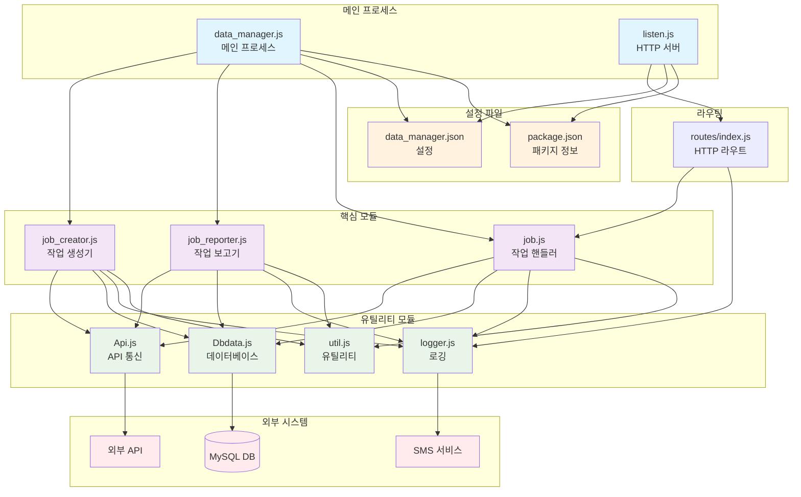
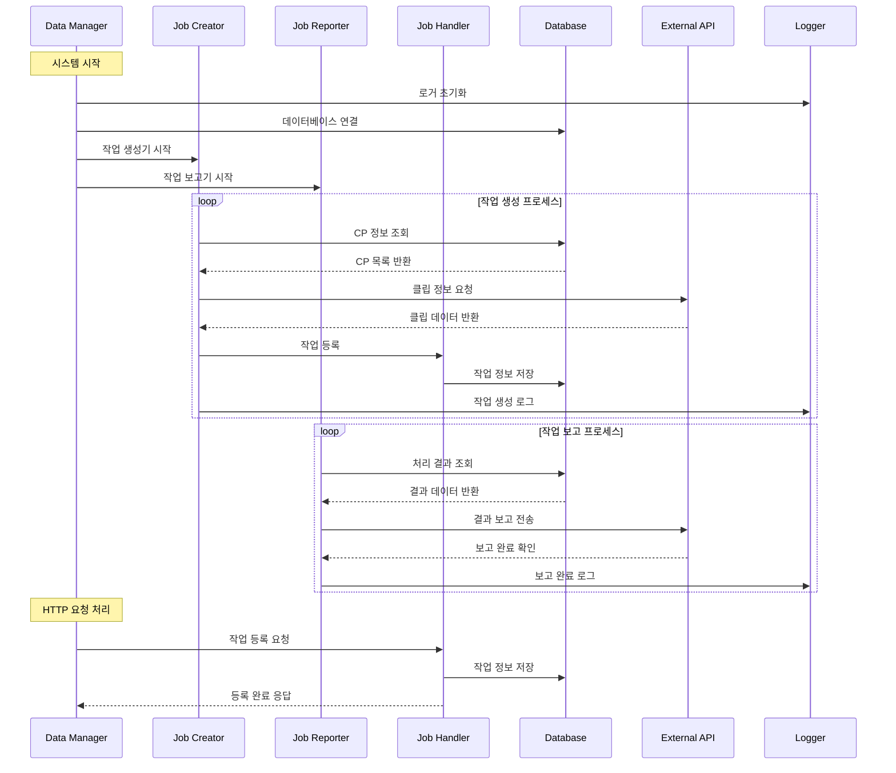
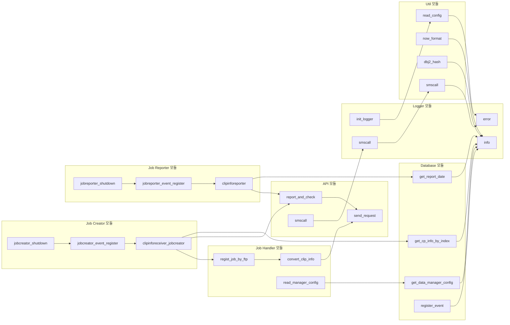

# Data Manager 시스템 아키텍처 다이어그램

## 시스템 개요
이 시스템은 비디오 트랜스코딩을 위한 데이터 관리 시스템으로, 클립 정보를 수집하고 작업을 생성하며 결과를 보고하는 역할을 합니다.

## 전체 시스템 아키텍처

## 데이터 흐름 다이어그램

## 모듈 상세 관계도

## 설정 및 의존성 관계

```mermaid
graph TD
    subgraph "설정 파일"
        CONFIG_MAIN[data_manager.json]
        CONFIG_TAG[tagstory_transcode_data_manager.json]
        CONFIG_THUMB[thumbnail_data_manager.json]
        PKG[package.json]
    end
    
    subgraph "메인 실행 파일"
        DM[data_manager.js]
        LIS[listen.js]
        TAG[tagstory_data_manager.js]
        THUMB[thumbnail_data_manager.js]
    end
    
    subgraph "공통 모듈"
        JS_API[js/Api.js]
        JS_DB[js/Dbdata.js]
        JS_LOG[js/logger.js]
        JS_UTIL[js/util.js]
        JS_JOB[js/job.js]
        JS_JC[js/job_creator.js]
        JS_JR[js/job_reporter.js]
    end
    
    subgraph "라우팅"
        ROUTES[routes/index.js]
    end
    
    %% 설정 파일 연결
    DM --> CONFIG_MAIN
    DM --> PKG
    LIS --> CONFIG_MAIN
    LIS --> PKG
    TAG --> CONFIG_TAG
    TAG --> PKG
    THUMB --> CONFIG_THUMB
    THUMB --> PKG
    
    %% 모듈 의존성
    DM --> JS_API
    DM --> JS_DB
    DM --> JS_LOG
    DM --> JS_UTIL
    DM --> JS_JOB
    DM --> JS_JC
    DM --> JS_JR
    
    LIS --> JS_API
    LIS --> JS_DB
    LIS --> JS_LOG
    LIS --> JS_UTIL
    LIS --> JS_JOB
    LIS --> ROUTES
    
    TAG --> JS_API
    TAG --> JS_DB
    TAG --> JS_LOG
    TAG --> JS_UTIL
    TAG --> JS_JOB
    TAG --> JS_JC
    TAG --> JS_JR
    
    THUMB --> JS_API
    THUMB --> JS_DB
    THUMB --> JS_LOG
    THUMB --> JS_UTIL
    THUMB --> JS_JOB
    THUMB --> JS_JC
    THUMB --> JS_JR
    
    ROUTES --> JS_JOB
    ROUTES --> JS_LOG
    
    %% 모듈 간 의존성
    JS_JC --> JS_JOB
    JS_JC --> JS_UTIL
    JS_JC --> JS_LOG
    JS_JR --> JS_UTIL
    JS_JR --> JS_LOG
    JS_JOB --> JS_UTIL
    JS_JOB --> JS_LOG
    JS_API --> JS_UTIL
    JS_API --> JS_LOG
    JS_DB --> JS_LOG
```

## 주요 기능별 역할

### 1. Data Manager (data_manager.js)
- **역할**: 시스템의 메인 진입점
- **기능**: 
  - 설정 파일 로드
  - 데이터베이스 연결 초기화
  - Job Creator와 Job Reporter 시작
  - 예외 처리 및 SMS 알림

### 2. Job Creator (job_creator.js)
- **역할**: 클립 정보를 수집하여 작업을 생성
- **기능**:
  - CP(Content Provider) 정보 조회
  - 외부 API에서 클립 정보 수집
  - 작업 등록 및 데이터베이스 저장
  - 주기적 폴링 (기본 5초)

### 3. Job Reporter (job_reporter.js)
- **역할**: 처리된 작업의 결과를 외부 시스템에 보고
- **기능**:
  - 처리 결과 데이터 조회
  - 외부 API로 결과 보고 전송
  - 주기적 폴링 (기본 15초)

### 4. Job Handler (job.js)
- **역할**: 개별 작업의 처리 로직 담당
- **기능**:
  - 작업 등록 및 변환
  - API 정보와 CP 정보 병합
  - 작업 상태 관리

### 5. API 모듈 (Api.js)
- **역할**: 외부 API 통신 및 SMS 알림
- **기능**:
  - HTTP/HTTPS 요청 처리
  - 재시도 로직
  - SMS 알림 전송
  - Slack 알림

### 6. Database 모듈 (Dbdata.js)
- **역할**: MySQL 데이터베이스 연결 및 쿼리 처리
- **기능**:
  - Master/Slave DB 연결 풀 관리
  - CP 정보, 설정, 보고 데이터 조회
  - 이벤트 정보 등록

### 7. Logger 모듈 (logger.js)
- **역할**: 로깅 및 알림 시스템
- **기능**:
  - Winston 기반 로깅
  - 일별 로그 파일 로테이션
  - SMS/메일 알림
  - 로그 레벨 관리

### 8. Util 모듈 (util.js)
- **역할**: 공통 유틸리티 함수
- **기능**:
  - 설정 파일 읽기
  - 시간 포맷팅
  - 해시 생성
  - SMS 전송
  - 파일 시스템 작업

### 9. HTTP 서버 (listen.js)
- **역할**: HTTP API 서버
- **기능**:
  - Express 기반 웹 서버
  - 작업 등록 API 제공
  - 멀티 프로세스 지원

이 시스템은 비디오 트랜스코딩 파이프라인의 데이터 관리 부분을 담당하며, 클립 정보 수집부터 작업 생성, 결과 보고까지의 전체 워크플로우를 관리합니다.

